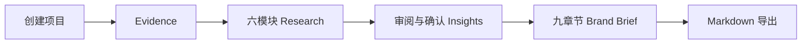
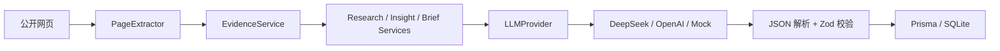

# BrandScope

> 面向品牌营销、海外营销和 GTM 从业者的证据驱动 AI 品牌研究工作台。

[](https://brandscope-eta.vercel.app)


**Evidence → Research → Insights → Brand Brief**

BrandScope 把分散的公开资料整理为可追溯的研究、可由人审阅的洞察，以及可继续修改的品牌营销简报。公开 Demo 无需登录或 API Key，可直接查看三个完整案例；它不执行实时 AI，也不冒充实时市场监控。

| 固定 Benchmark | Evidence | AI 与质量机制 | 公开体验 |
|---|---:|---|---|
| Apple 中国、Anker 德国、Dyson 中国 | 25 条具体文章或报告 | DeepSeek 真实调用、结构化输出与 Zod 校验 | 只读 Demo、34+ 自动测试 |

质量验收结果：**Apple B-、Anker B+、Dyson B+；18 条 Insights 中 11 条可直接保留。** 三份 Brief 均达到“修改后可以讨论”，不等同于未经人工核验即可发布。

## 产品问题

品牌研究往往散落在搜索、AI 工具、文档和表格中。来源与结论脱节，聊天结果难以编辑、复查和转交，洞察也容易停留在“市场竞争激烈”一类空泛判断。

## 目标用户

- 品牌营销、海外营销和 GTM 从业者
- 市场研究与品牌策划人员
- 需要快速完成桌面研究的实习生与初级营销人员

## 产品解决方案

BrandScope 不是聊天机器人，而是一条固定工作流。AI 负责整理证据、生成候选研究和洞察；用户负责核验、修改、确认，并决定哪些内容进入最终简报。

## 工作流



## 核心功能

- 项目创建、查看、编辑和删除；SQLite 本地持久化
- 品牌背景、市场信号、目标用户、用户痛点、竞品定位、机会与风险六模块研究
- 洞察编辑、确认、删除和排序，最终决策保留给用户
- 仅使用已确认洞察生成九章节简报
- 简报编辑、复制和 Markdown 下载
- 公开部署的三案例只读 Benchmark Demo

## Evidence Layer

Evidence Layer 负责 URL 规范化、来源分级、正文提取、清洗、去重和限长。模型读取的是带稳定 Evidence ID 的网页正文，而不是搜索摘要；页面内容只作为研究材料，不作为系统指令。付费墙、反爬或无法访问的来源不会被伪装为成功证据。

## AI Provider 架构



页面和业务流程不依赖具体模型。无效结构不会写入数据库，生成失败也不会覆盖上一版成功数据。

## 技术栈

- Next.js 16、React 19、TypeScript strict、Tailwind CSS 4
- Prisma 6、SQLite、Zod
- DeepSeek Chat Completions、OpenAI Responses API、Mock Provider
- Cheerio、Node Test Runner、ESLint

## Benchmark 方法

固定 Apple 中国、Anker 德国、Dyson 中国三个案例做回归比较。每个案例使用至少 8 篇具体文章或报告，排除首页、联系页、搜索页和栏目页，逐项评价 Evidence、六个 Research 模块、Insight 去留和 Brief 可讨论程度。

详见 [Benchmark 说明](docs/benchmark.md) 与 [质量报告](docs/brand-quality-report-v2.md)。

## 质量评估

| 案例 | Evidence | Research | 可直接保留 Insight | Brief |
|---|---:|---:|---:|---|
| Apple｜中国 | 8 | 6/6 | 3/6 | B-，修改后可讨论 |
| Anker｜德国 | 9 | 6/6 | 4/6 | B+，修改后可讨论 |
| Dyson｜中国 | 8 | 6/6 | 4/6 | B+，修改后可讨论 |

## 页面截图

| 项目列表 | Apple Research | Apple Insights |
|---|---|---|
|  |  |  |

| Apple Brief | Anker Research | Dyson Brief |
|---|---|---|
|  |  |  |

## 本地启动

需要 Node.js 22.13+ 与 pnpm。

```bash
pnpm install
cp .env.example .env
pnpm setup
pnpm dev
```

访问 `http://localhost:3000`。默认 Mock 模式无需 API Key。

## DeepSeek 配置

仅在本地 `.env` 中配置，不要提交该文件：

```dotenv
AI_PROVIDER="deepseek"
DEEPSEEK_API_KEY=""
DEEPSEEK_MODEL="deepseek-v4-flash"
DEEPSEEK_BASE_URL="https://api.deepseek.com"
```

## 公开 Demo 说明

[打开只读 Benchmark Demo](https://brandscope-eta.vercel.app)

- 数据来自三个固定 Benchmark 快照，不依赖线上 SQLite
- 无需登录、API Key 或等待模型调用
- 禁止创建、编辑、删除、重新生成和保存，写接口统一返回 HTTP 403
- 真实 AI 研究仅在本地开发模式开放

## 安全边界

- API Key 只允许服务端读取；`.env`、数据库、缓存和构建产物均被 Git 忽略
- 外部网页内容不作为系统指令
- 模型输出经结构校验后才写入数据库
- Research 区分来源事实、用户/市场信号与 AI 推断

## 当前限制

- SQLite 适合本地单用户模式，不用于公开部署写入
- 付费墙、反爬和动态渲染页面可能无法提取
- Evidence 分级与模型结论仍需人工核验
- 公开 Demo 不执行实时搜索或付费模型请求

## Roadmap

- 持续使用三个固定 Benchmark 回归 Evidence 与内容质量
- 验证真实使用需求后，再评估最小云持久化方案
- 在证据质量稳定前，不引入 RAG、多 Agent、团队或计费系统

## 项目目录

```text
app/                 页面、API 与展示组件
lib/                 数据库、校验与公开 Demo 边界
services/ai/         Provider、Prompt、Schema 与 AI 服务
services/search/     搜索 Provider 与查询策略
services/evidence/   正文提取、清洗、去重与 Evidence 组装
prisma/              Schema、迁移、Seed 与演示快照
tests/               服务契约、安全与质量测试
docs/                产品、架构、Benchmark 与作品集材料
public/screenshots/  对外展示截图
```

## License

[MIT](LICENSE)
