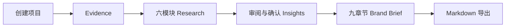
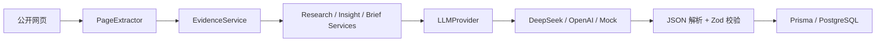
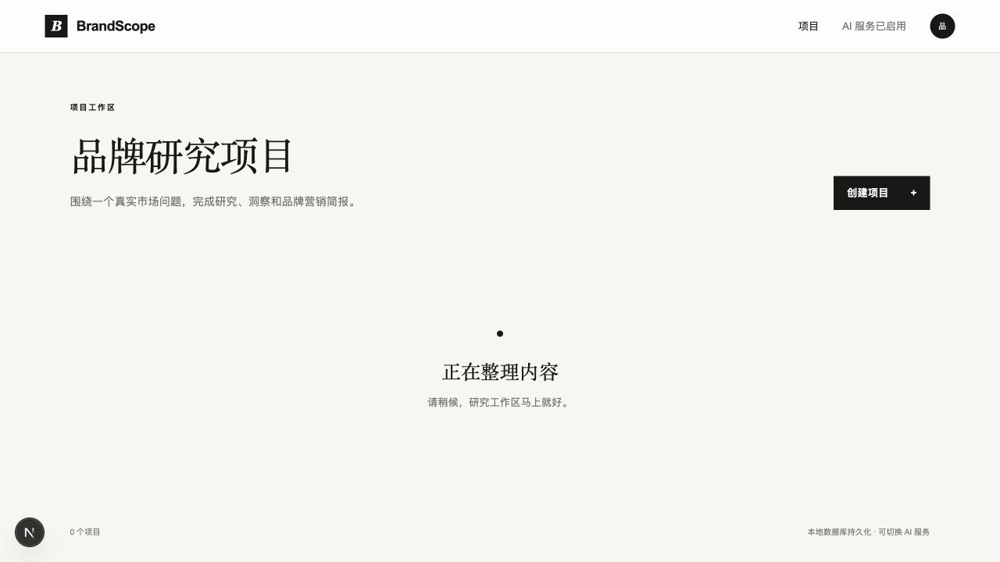

# BrandScope

> 面向品牌营销、海外营销和 GTM 从业者的证据驱动 AI 品牌研究工作台。

[](https://brandscope-eta.vercel.app)


**Evidence → Research → Insights → Brand Brief**

BrandScope 把分散的公开资料整理为可追溯的研究、可由人审阅的洞察，以及可继续修改的品牌营销简报。无需登录即可查看三个完整 Benchmark；邮箱登录后可创建私人项目，提交公开网页并运行一次真实 AI 研究闭环。

| 固定 Benchmark | Evidence | AI 与质量机制 | 公开体验 |
|---|---:|---|---|
| Oura 美国、Whoop 美国、Ultrahuman 印度 | 每组 8 条可核验资料 | DeepSeek 真实调用、结构化输出与 Zod 校验 | 公开只读 Benchmark + 私人真实研究 |

公开 Benchmark 重点展示从 Evidence 到海外 GTM 决策简报的完整链路。所有策略数字均应在执行前建立业务基线并人工核验；产品定位是研究与决策初稿工具，不替代正式市场调研。

## 产品问题

品牌研究往往散落在搜索、AI 工具、文档和表格中。来源与结论脱节，聊天结果难以编辑、复查和转交，洞察也容易停留在“市场竞争激烈”一类空泛判断。

## 目标用户

- 品牌营销、海外营销和 GTM 从业者
- 市场研究与品牌策划人员
- 需要快速完成桌面研究的实习生与初级营销人员

## 产品解决方案

BrandScope 不是聊天机器人，而是一条固定工作流。AI 负责整理证据、生成候选研究和洞察；用户负责核验、修改、确认，并决定哪些内容进入最终简报。

## 工作流



## 核心功能

- 邮箱注册与登录；用户只能访问自己的研究项目
- 项目创建、查看、编辑和删除；托管 PostgreSQL 持久化
- 品牌背景、市场信号、目标用户、用户痛点、竞品定位、机会与风险六模块研究
- 洞察编辑、确认、删除和排序，最终决策保留给用户
- 私人真实研究仅使用已确认洞察生成九章节品牌简报；公开 Benchmark 进一步展示进入节奏、竞品、用户旅程、渠道、KOL、本地化、指标、单位经济、增长实验与访谈验证
- 简报编辑、复制和 Markdown 下载
- 三个公开只读 Benchmark；真实项目对创建者私有
- 每日项目、单项目生成次数与全站 AI 调用预算保护

## Evidence Layer

Evidence Layer 负责 URL 规范化、来源分级、正文提取、清洗、去重和限长。模型读取的是带稳定 Evidence ID 的网页正文，而不是搜索摘要；页面内容只作为研究材料，不作为系统指令。付费墙、反爬或无法访问的来源不会被伪装为成功证据。

## AI Provider 架构



页面和业务流程不依赖具体模型。无效结构不会写入数据库，生成失败也不会覆盖上一版成功数据。

## 技术栈

- Next.js 16、React 19、TypeScript strict、Tailwind CSS 4
- Prisma 6、Supabase PostgreSQL / Auth、Zod
- DeepSeek Chat Completions、OpenAI Responses API、Mock Provider
- Cheerio、Node Test Runner、ESLint

## Benchmark 方法

当前固定 Oura 美国、Whoop 美国、Ultrahuman 印度三个可穿戴品牌案例，覆盖成熟品类领导者、订阅型运动产品与新兴市场挑战者。每个案例关联 8 篇公开资料，逐项展示 Evidence、六个 Research 模块、Insight 审阅与 GTM Brief。

详见 [Benchmark 说明](docs/benchmark.md) 与 [质量报告](docs/brand-quality-report-v2.md)。

## 质量评估

| 案例 | Evidence | Research | Insight | GTM Brief |
|---|---:|---:|---:|---|
| Oura｜美国 | 8 | 6/6 | 8 条候选，含人工确认状态 | 完整决策初稿 |
| Whoop｜美国 | 8 | 6/6 | 8 条候选，含人工确认状态 | 完整决策初稿 |
| Ultrahuman｜印度 | 8 | 6/6 | 8 条候选，含人工确认状态 | 完整决策初稿 |

## 页面截图

| 项目列表 | Research 工作区 | Insights 决策区 |
|---|---|---|
|  |  |  |

| GTM Brief | Research 来源 | Brief 导出 |
|---|---|---|
|  |  |  |

## 本地启动

需要 Node.js 22.13+、pnpm，以及一个 PostgreSQL 数据库。复制环境变量模板后，填写 Supabase 的连接串、Project URL 与 anon key：

```bash
pnpm install
cp .env.example .env
pnpm db:generate
pnpm db:deploy
pnpm dev
```

数据库脚本会安全读取被 Git 忽略的 `.env.local`。访问 `http://localhost:3000`。默认 Mock 模式无需模型 API Key；登录与私人项目仍需 Supabase 配置。旧版 SQLite 数据不会自动上传，迁移前请保留本地数据库备份；v1.1 使用全新的 PostgreSQL Schema，三个 Benchmark 继续由版本化快照提供。

## DeepSeek 配置

仅在本地 `.env` 中配置，不要提交该文件：

```dotenv
AI_PROVIDER="deepseek"
DEEPSEEK_API_KEY=""
DEEPSEEK_MODEL="deepseek-v4-flash"
DEEPSEEK_BASE_URL="https://api.deepseek.com"
```

## 公开 MVP 说明

[打开只读 Benchmark Demo](https://brandscope-eta.vercel.app)

- 三个 Benchmark 来自版本化快照，无需登录、无需等待模型调用，并保持只读
- 登录后可创建私人项目；每位用户每天最多 2 个项目，每项目最多 8 个 URL
- 单项目最多发起 1 次 Research、1 次 Insights、1 次 Brief；达到全站日预算后停止真实调用
- 真实项目与 AI 调用记录持久化到 PostgreSQL；不会静默回退 Mock

## 安全边界

- API Key 只允许服务端读取；`.env`、数据库、缓存和构建产物均被 Git 忽略
- 外部网页内容不作为系统指令
- 模型输出经结构校验后才写入数据库
- Research 区分来源事实、用户/市场信号与 AI 推断

## 当前限制

- 邮箱确认邮件依赖 Supabase Auth；公开体验不提供找回密码、团队或付费能力
- 付费墙、反爬和动态渲染页面可能无法提取
- Evidence 分级与模型结论仍需人工核验
- 不进行自动搜索；真实研究只读取用户提交且成功提取的网页

## Roadmap

- 持续使用三个固定 Benchmark 回归 Evidence 与内容质量
- 通过固定 Benchmark 与匿名化使用指标持续验证真实使用价值
- 在证据质量稳定前，不引入 RAG、多 Agent、团队或计费系统

## 项目目录

```text
app/                 页面、API 与展示组件
lib/                 数据库、校验与公开 Demo 边界
services/ai/         Provider、Prompt、Schema 与 AI 服务
services/search/     搜索 Provider 与查询策略
services/evidence/   正文提取、清洗、去重与 Evidence 组装
prisma/              Schema、迁移、Seed 与演示快照
tests/               服务契约、安全与质量测试
docs/                产品、架构、Benchmark 与作品集材料
public/screenshots/  对外展示截图
```

## License

[MIT](LICENSE)
