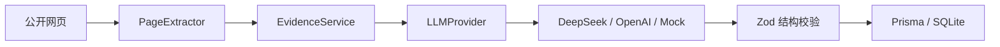
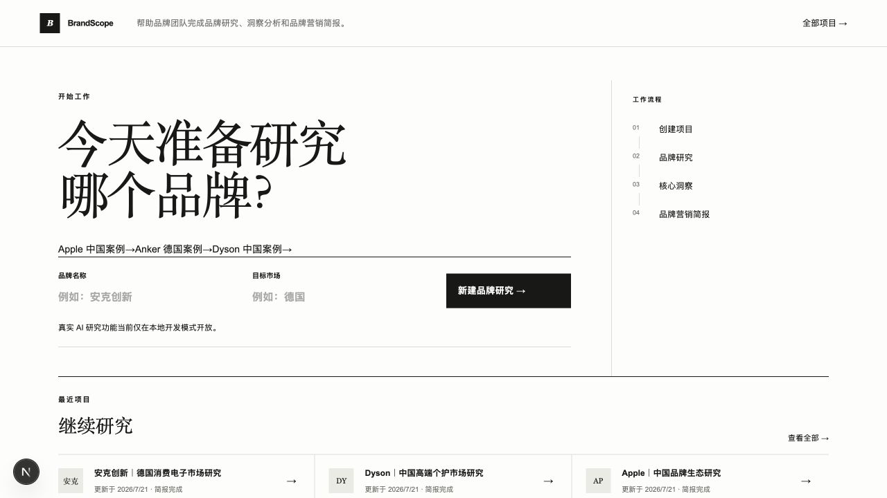
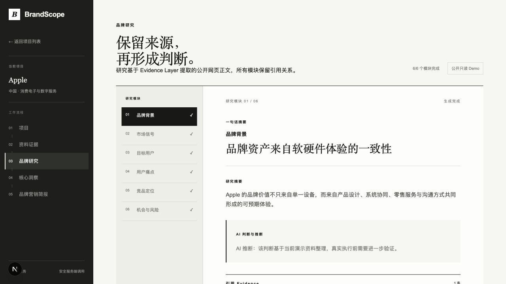
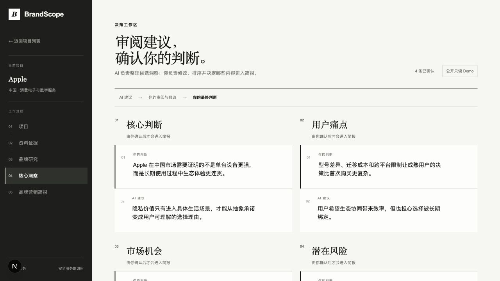
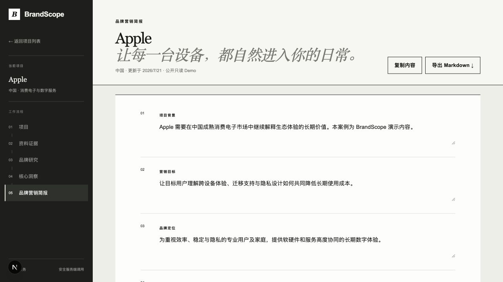
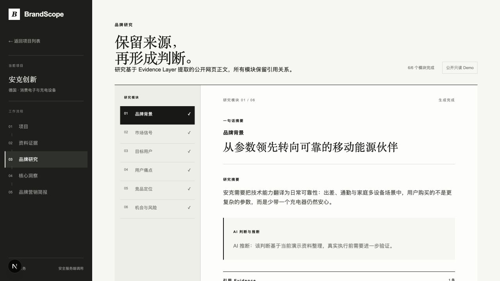
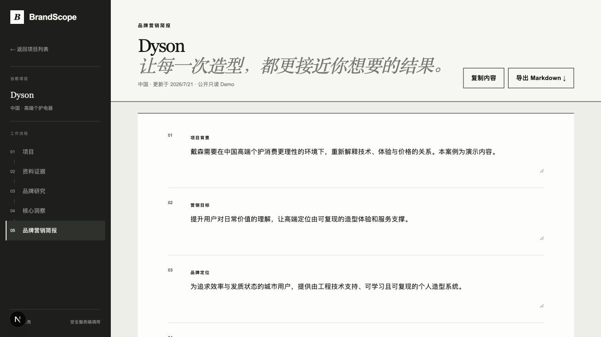

# BrandScope

> 面向品牌营销、海外营销与 GTM 从业者的 AI 品牌研究工作台。

BrandScope 将分散在搜索、AI 工具、文档和表格中的品牌研究工作，收敛为一条可审阅的固定流程：

**项目 → Evidence → 品牌研究 → 核心洞察 → 品牌营销简报**

- **为什么存在：**减少品牌团队在 Google、AI、Notion、Excel 和 PPT 间的反复搬运。
- **如何体验：**无需登录或 API Key，直接打开 Apple、Anker 或 Dyson 只读 Benchmark 项目。
- **核心成果：**真实网页正文经 Evidence Layer 清洗后交给 DeepSeek，输出经 Zod 校验的 Research、Insights 和 Brief。

## 解决的问题

品牌研究经常需要在公开资料、竞品信息、用户信号和营销简报之间反复切换。BrandScope 不是聊天机器人，而是用有状态、可编辑、保留来源的工作流程承接这些任务。

## 目标用户

- 品牌营销、海外营销和 GTM 从业者
- 市场研究与品牌策划人员
- 需要快速完成桌面研究的实习生与初级营销人员

## 核心工作流


## 主要功能

- 项目 CRUD 与 SQLite 本地持久化
- 公开网页发现、URL 去重、来源分级和正文提取
- 品牌背景、市场信号、目标用户、用户痛点、竞品定位、机会与风险六模块研究
- 洞察编辑、确认、删除和排序
- 仅使用已确认洞察生成九章节简报
- 简报编辑、复制和 Markdown 下载
- Mock、OpenAI 与 DeepSeek Provider 解耦
- 公开部署的三案例只读 Demo 模式

## AI 与 Evidence 架构



网页中的内容只被当作研究材料，不被当作系统指令。模型输出必须通过 Zod Schema；无效 JSON 不会写入数据库。

## 技术栈

- Next.js 16、React 19、TypeScript strict、Tailwind CSS 4
- Prisma 6、SQLite
- DeepSeek Chat Completions、OpenAI Responses API、Zod
- Cheerio、Node Test Runner、ESLint

## 页面截图

| 首页 | Apple Research | Apple Insights |
|---|---|---|
|  |  |  |

| Apple Brief | Anker Research | Dyson Brief |
|---|---|---|
|  |  |  |

## Benchmark Dataset 与质量结果

Benchmark v2 固定 Apple 中国、Anker 德国和 Dyson 中国，每个案例使用至少 8 篇具体报告或文章，不使用首页填充 Evidence。

| 案例 | Evidence | Research | Insight 可直接保留 | Brief |
|---|---:|---:|---:|---|
| Apple｜中国 | 8 | 6/6 | 3/6 | B-，修改后可讨论 |
| Anker｜德国 | 9 | 6/6 | 4/6 | B+，修改后可讨论 |
| Dyson｜中国 | 8 | 6/6 | 4/6 | B+，修改后可讨论 |

详见 [Benchmark 说明](docs/benchmark.md) 和 [质量报告](docs/brand-quality-report-v2.md)。

## 本地启动

需要 Node.js 22.13+ 与 pnpm。

```bash
pnpm install
cp .env.example .env
pnpm setup
pnpm dev
```

打开 `http://localhost:3000`。`.env.example` 默认使用 Mock Provider，不需要 API Key。

## DeepSeek 配置

仅在本地 `.env` 中修改：

```dotenv
AI_PROVIDER="deepseek"
DEEPSEEK_API_KEY=""
DEEPSEEK_MODEL="deepseek-v4-flash"
DEEPSEEK_BASE_URL="https://api.deepseek.com"
SEARCH_PROVIDER="public"
```

把密钥粘贴到 `DEEPSEEK_API_KEY` 的空引号内。不要提交 `.env`。

## Demo 模式

Vercel 等公开环境使用 `PUBLIC_DEMO_MODE=true`：

- 仅从代码中的三个 Benchmark 快照读取数据
- 无需 SQLite、登录、API Key 或模型等待
- 服务端禁止创建、编辑、删除、重新生成和保存
- 真实 AI 研究功能当前仅在本地开发模式开放

## 当前限制

- SQLite 只用于本地单用户模式，不用于 Vercel 公开写入
- 付费墙、反爬、动态渲染页面可能无法提取
- 来源分级和 AI 判断仍需人工核验
- 公开 Demo 不执行付费模型请求

## Roadmap

1. 继续用三个固定 Benchmark 跟踪 Evidence 和 Prompt 质量
2. 如果产品验证成立，再评估最小云数据库迁移
3. 部署前不引入登录、团队、RAG 或多 Agent

## 项目目录

```text
app/                 页面、API 和展示组件
lib/                 数据库、输入校验与 Demo 边界
services/ai/         Provider、Prompt、Schema 和 AI 服务
services/search/     公开网页发现与搜索 Provider
services/evidence/   正文提取、清洗、去重与 Evidence 组装
prisma/              Schema、迁移、Seed 和演示快照
tests/               服务契约、安全与质量测试
docs/                产品、架构、Benchmark 和开发文档
public/screenshots/  作品展示截图
```

## License

[MIT](LICENSE)
