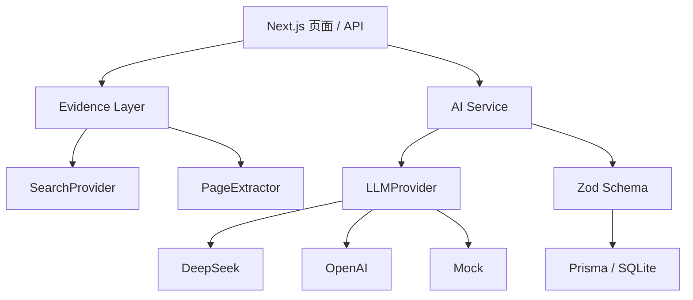
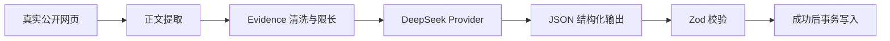

# BrandScope 技术架构

## AI 数据链路

## 部署模式

| 环境 | 数据 | 可写 | AI |
|---|---|---:|---|
| 本地 | Prisma + SQLite | 是 | Mock / DeepSeek / OpenAI |
| Vercel 公开 Demo | 内置 Benchmark 快照 | 否 | 不发起付费请求 |

`PUBLIC_DEMO_MODE=true` 或 Vercel 运行环境会启用只读模式。读取路由不依赖 SQLite，写入路由统一返回 HTTP 403。API Key 只在服务端 Provider 中读取。

## 设计决策

- **Provider 解耦：**页面只调用业务 Service，切换 Mock、OpenAI 或 DeepSeek 不修改页面与数据库。
- **验证后保存：**模型文本先解析为 JSON，再通过 Zod；失败不覆盖已有成功数据。
- **部署分层：**本地保留完整写入和真实 AI，公开环境只读取 Benchmark 快照。
- **暂不引入 RAG：**单项目的筛选后 Evidence 可以受控地一次性进入上下文，当前无需向量数据库。

## v1.0.0 数据边界

公开 Demo 不执行搜索或模型调用，不读取 API Key，也不依赖 SQLite 写入。真实研究链路只在本地受控环境运行。
