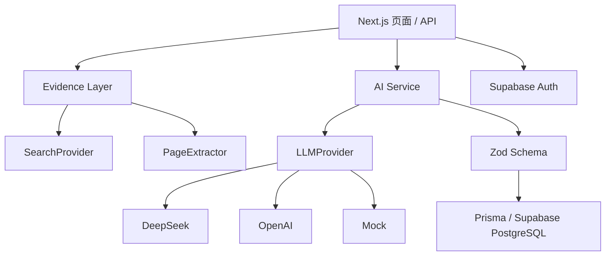
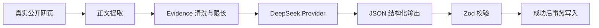

# BrandScope 技术架构

## AI 数据链路

## 部署模式

| 环境 | 数据 | 可写 | AI |
|---|---|---:|---|
| 未登录 | 内置 Benchmark 快照 | 否 | 不发起付费请求 |
| 已登录 | Prisma + Supabase PostgreSQL | 仅自己的项目 | DeepSeek |

Benchmark ID 在服务端白名单中，所有写路由统一返回 HTTP 403。私人项目写路由先验证 Supabase access token，再用 `ownerId` 约束数据库查询。模型密钥只在服务端 Provider 中读取。

## 设计决策

- **Provider 解耦：**页面只调用业务 Service，切换 Mock、OpenAI 或 DeepSeek 不修改页面与数据库。
- **验证后保存：**模型文本先解析为 JSON，再通过 Zod；失败不覆盖已有成功数据。
- **部署分层：**Benchmark 使用只读快照；真实项目使用鉴权后的 PostgreSQL 持久化。
- **暂不引入 RAG：**单项目的筛选后 Evidence 可以受控地一次性进入上下文，当前无需向量数据库。

## v1.1 数据边界

公开 Benchmark 不执行搜索或模型调用。已登录用户可提交最多 8 个公开 URL；Evidence Layer 执行 SSRF 检查和正文限长，Research、Insights 与 Brief 各仅允许生成一次，并受全站日调用预算约束。
