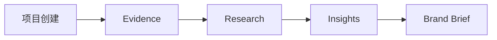

# BrandScope 产品概览

BrandScope 是面向品牌营销、海外营销与 GTM 从业者的 AI 品牌研究工作台。产品不以对话为中心，而是将研究材料、AI 判断和用户决策放进一条可追溯工作流。

## MVP 验证命题

用户能否在 15 分钟内完成一次有来源的品牌研究，并获得一份可继续修改的品牌营销简报。

## 责任边界

- AI 负责整理 Evidence、提供候选判断和生成结构化初稿。
- 用户负责核验事实、修改洞察、确认哪些判断进入简报。
- 公开 Demo 只展示固定 Benchmark 快照，不冒充实时 AI 研究。

## v1.0.0 成果

- 三个固定 Benchmark：Apple 中国、Anker 德国、Dyson 中国
- 25 条具体 Evidence；18 条 Insights 中 11 条可直接保留
- DeepSeek 真实调用、结构化输出与 Zod 校验
- 34+ 自动测试与公开只读 Demo

## 阶段记录

MVP → UX 打磨 → Mock AI → DeepSeek → Validation → Evidence Layer → Benchmark v2 → Public Demo → Deployment。产品始终保持一个主流程，没有引入登录、团队、计费、RAG 或多 Agent。
