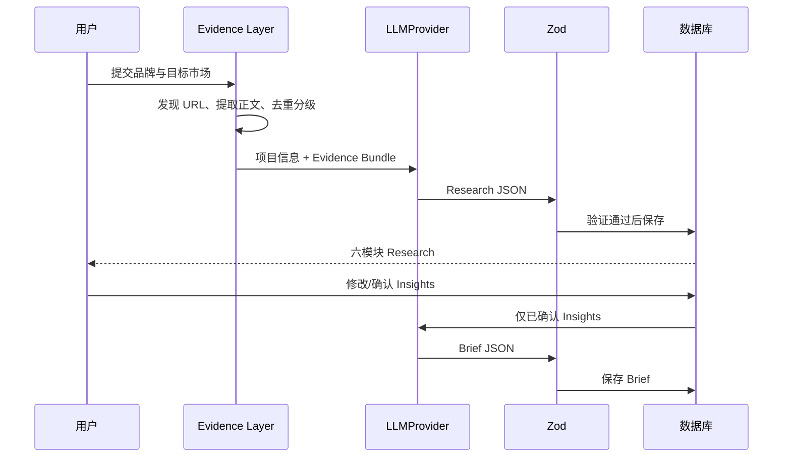

# BrandScope 工作流

任何网络失败或 Schema 失败都发生在替换上一版成功数据之前。公开 Demo 绕过写入和模型请求，直接展示固定快照。

## 阶段与人工责任

| 阶段 | 系统负责 | 用户负责 |
|---|---|---|
| Evidence | 提取、清洗、去重、分级 | 核验来源与适用范围 |
| Research | 按六模块组织事实、信号和推断 | 识别证据不足与地域错配 |
| Insights | 生成候选观察、判断和行动影响 | 修改、删除、排序与确认 |
| Brief | 只用已确认洞察生成九章节初稿 | 审阅策略、渠道、KPI 与最终表达 |

## 公开 Demo 工作流

公开访问直接读取三套已验收快照；所有写入、重新生成和保存请求返回 403。它用于展示已完成的工作成果，不代表在线实时研究。
