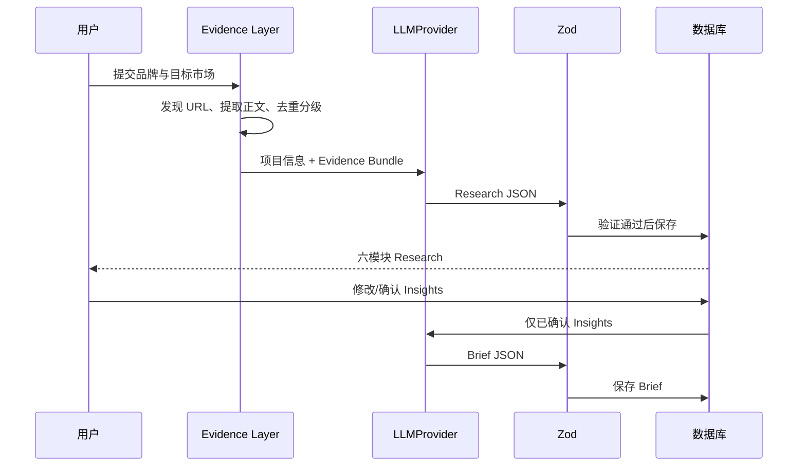

# BrandScope 工作流

```mermaid
sequenceDiagram
  participant U as 用户
  participant E as Evidence Layer
  participant L as LLMProvider
  participant V as Zod
  participant D as 数据库
  U->>E: 提交品牌与目标市场
  E->>E: 发现 URL、提取正文、去重分级
  E->>L: 项目信息 + Evidence Bundle
  L->>V: Research JSON
  V->>D: 验证通过后保存
  D-->>U: 六模块 Research
  U->>D: 修改/确认 Insights
  D->>L: 仅已确认 Insights
  L->>V: Brief JSON
  V->>D: 保存 Brief
```

任何网络失败或 Schema 失败都发生在替换上一版成功数据之前。公开 Demo 绕过写入和模型请求，直接展示固定快照。
